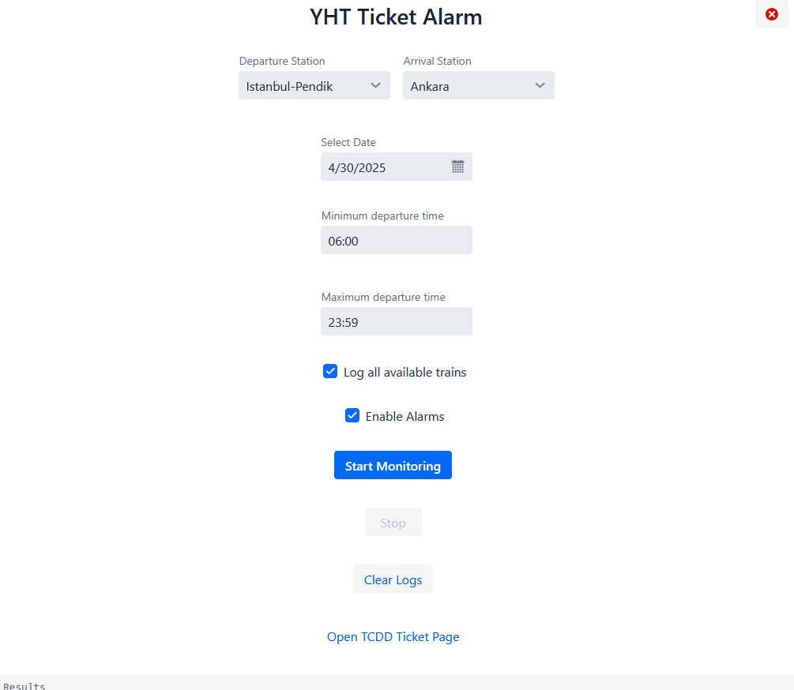

# YHT Ticket Alarm

YHT Ticket Alarm is a personal tool for checking train ticket availability and alerting users when a suitable ticket is found. It displays trip details and helps users quickly act on available seats.

## Features

- Checks train ticket availability based on user requirements
- Alerts the user and shows trip details when a suitable ticket is found
- Simple web frontend (Vaadin + Spring Boot) accessible at [http://localhost:9090](http://localhost:9090)
- No account or registration required

## Usage

1. **Download** the latest fat JAR from the [Releases](https://github.com/yourusername/your-repo/releases) section.
2. **Run** the application with:
   java -jar yht-ticket-alarm.jar
3. **Open** your browser and go to [http://localhost:9090](http://localhost:9090).

## Motivation

This tool was created to meet a personal need for monitoring YHT train ticket availability. It is not a commercial project, but a practical solution for a real-world problem.

## Future Plans

- Integrate WebDriver to automatically open the YHT trips page with available seats
- Direct users to seat selection and payment pages for faster booking

## Requirements

- Java 17 or newer

## License

This project is provided as-is, with no warranty or guarantee. Use at your own risk.